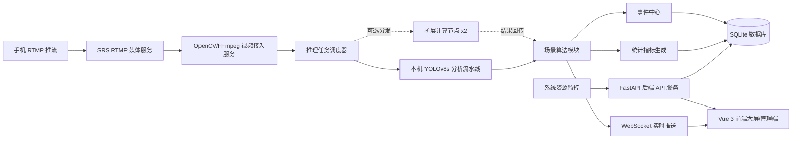
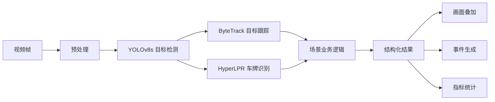
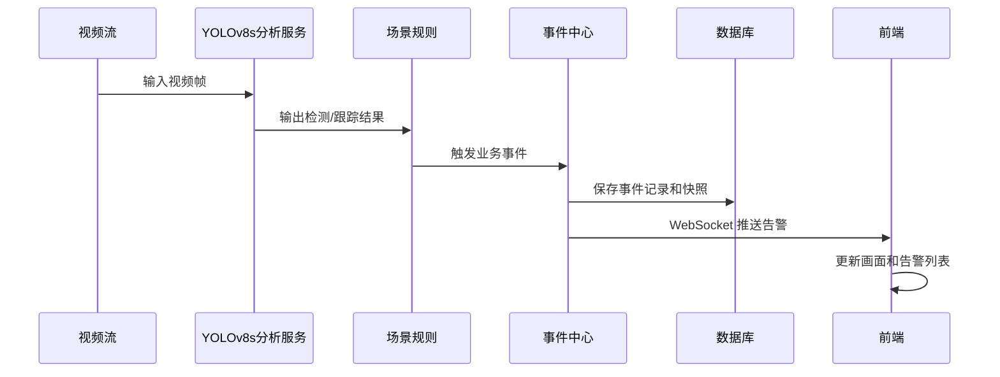

# 智慧交通视觉识别系统设计方案 V1.0

## 1. 项目概述

本项目面向智慧交通识别实训，建设一个模拟“云边端协同”的交通视觉感知系统。系统主要采用 RTMP 作为实时视频输入方式，一台手机将视频流推送到主服务器上的 SRS 流媒体服务，由一台高性能笔记本作为主服务器，在 WSL2 Ubuntu 环境中完成拉流、YOLOv8s 推理、事件分析、数据存储和前端服务，并通过 Web 前端展示实时监控、告警、统计和历史记录。受限于当前只有一台可用手机，V1.0 演示采用“单路视频输入 + Web 界面切换当前视频处理模式”的方式覆盖四个场景；系统同时预留计算节点接入接口，后续可接入另外两台设备作为扩展计算节点，为多路视频推理提供算力支持。

系统覆盖四类核心业务场景：

1. 车牌识别与闸机通行决策
2. 车辆识别与拥堵热力图绘制
3. 禁停区域车辆跟踪与长时间停留告警
4. 道路异常物体检测与告警

系统不直接控制真实闸机，只输出模拟闸机信号，例如 `OPEN`、`DENY`、`UNKNOWN`。

## 2. 设计目标

### 2.1 功能目标

- 支持手机端 RTMP 推流到 SRS，保证演示稳定性。
- 支持在 Web 界面修改当前视频处理模式，在同一路视频输入上切换车牌识别、拥堵热力图、禁停跟踪和道路异常检测。
- 支持设备注册、设备在线状态、视频流状态监控。
- 支持不同处理模式绑定不同检测模型和参数。
- 支持计算节点扩展接口，预留两台设备接入后承担辅助推理任务。
- 支持实时监控展示，包括视频画面、检测框、识别结果、热力图、区域状态和告警信息。
- 支持系统资源监控，包括 CPU、GPU、内存、推理帧率、视频流延迟。
- 支持数据统计与历史查询，包括车牌识别数、拥堵趋势、违规停车事件、道路异常事件。

### 2.2 非功能目标

- 实时性：单路视频端到端延迟目标控制在 5-10 秒，演示模式下推理帧率 40-60 FPS。
- 可扩展性：四类场景通过统一视频分析流水线接入，后续可新增模型和场景；系统预留计算节点注册、心跳、任务分配和结果回传接口。
- 可维护性：前端、后端、算法服务分层清晰，采用 Vue 3 + Vite、FastAPI、Ultralytics + PyTorch 等成熟技术，方便团队并行开发。
- 可演示性：核心功能优先围绕评审演示闭环，保证“看得见结果、查得到历史、解释得清设计”。

## 3. 总体架构

系统采用“采集端 + 分析服务 + 平台服务 + 展示端”的分层架构。



### 3.1 架构分层

| 层级 | 职责 | 主要组件 |
| :--- | :--- | :--- |
| 采集层 | 获取实时画面或演示视频 | 手机 RTMP 推流、本地视频文件兜底 |
| 接入层 | RTMP 接收、拉流、解码、抽帧、流状态检测 | SRS、OpenCV VideoCapture + FFmpeg |
| 算法层 | 目标检测、车牌识别、跟踪、热力图、异常检测 | YOLOv8s、Ultralytics + PyTorch、HyperLPR、ByteTrack、场景分析器 |
| 服务层 | 设备管理、计算节点管理、模型管理、事件管理、统计查询 | FastAPI + Uvicorn、SQLite、SQLAlchemy/SQLModel、WebSocket |
| 展示层 | 实时画面、告警、图表、历史查询、系统监控 | Vue 3 + Vite、Element Plus、ECharts、MJPEG/Canvas |

## 4. 物理部署设计

结合团队设备，建议采用“一台高性能笔记本作为主服务器 + 两台设备作为预留计算节点 + 一台手机采集端”的部署方式。V1.0 默认以主服务器单机完成完整闭环，手机只负责持续推送一条 RTMP 视频流，四个业务场景通过 Web 界面的处理模式切换实现。后续如果具备多路视频或更高负载需求，另外两台设备可通过扩展接口接入提供计算支持。

| 设备 | 建议角色 | 说明 |
| :--- | :--- | :--- |
| 高性能笔记本 1 | 主服务器 | Windows 宿主机 + WSL2 Ubuntu + Conda/venv 环境，运行 SRS、FastAPI、SQLite、前端静态服务、系统管理模块和默认 AI 推理任务 |
| 高性能笔记本 2 | 预留计算节点 A | 通过节点注册接口接入，后续可分担车牌识别、车辆检测、道路异常等推理任务 |
| 高性能笔记本 3 | 预留计算节点 B | 通过节点注册接口接入，后续可分担多路视频推理，也可作为备用演示机 |
| 轻薄本 | 前端展示端 | 浏览器访问系统大屏和管理页面 |
| 手机 1 | 视频采集端 | 持续推送同一路 RTMP 视频流，演示时移动手机位置并在 Web 端切换当前处理模式 |
| 校园网 | 局域网通信 | 所有设备连接同一局域网，使用 IP 地址访问 |

### 4.1 推荐演示部署

第一阶段为了降低联调复杂度，采用主服务器单机集成部署：

- 主服务器在 WSL2 Ubuntu 中同时运行 SRS、FastAPI 后端、SQLite 数据库、YOLOv8s 算法服务和 Vue 3 前端。
- 手机通过局域网向主服务器 SRS 推送单路 RTMP 视频流。
- 轻薄本只负责浏览器访问展示页面。
- 另外两台高性能笔记本暂不作为系统运行的强依赖，只预留计算节点接入能力。
- 演示不同场景时，在 Web 界面选择当前视频处理模式，后端基于同一路视频流切换对应场景算法。
- 若后续多路视频推理压力过大，再将部分算法任务分配到计算节点 A/B。
- 所有核心服务通过 WSL 内 bash 一键脚本启动；PowerShell 仅作为 Windows 宿主机辅助入口，减少评审现场手动操作风险。

### 4.2 计算节点扩展设计

计算节点采用“主服务器调度、计算节点执行、结果回传”的方式接入。主服务器仍然是系统唯一的数据中心和控制中心，负责设备管理、视频流管理、任务调度、结果汇总、事件入库和前端展示；计算节点只承担模型推理或视频帧分析任务。

```text
主服务器
    -> 维护视频流、模型配置和任务队列
    -> 向计算节点分配推理任务
    -> 接收计算节点回传的检测结果
    -> 统一生成事件、统计数据和前端展示结果

计算节点 A/B
    -> 启动后向主服务器注册
    -> 定期上报 CPU/GPU/内存、任务状态和心跳
    -> 接收指定 camera_id/scenario 的推理任务
    -> 返回检测框、跟踪 ID、置信度和耗时等结构化结果
```

扩展策略：

| 阶段 | 部署方式 | 说明 |
| :--- | :--- | :--- |
| V1.0 默认 | 主服务器单机推理 | 优先保证演示稳定，所有核心功能可独立运行 |
| V1.0 预留 | 计算节点注册和心跳接口 | 能看到节点状态，为后续扩展留出接口 |
| V2.0 扩展 | 任务分配到计算节点 | 按场景或视频路数分配推理任务 |
| 后续优化 | 动态负载均衡 | 根据 GPU 占用、队列长度和推理延迟自动调度 |

### 4.3 RTMP 视频接入拓扑

推荐使用主服务器 WSL2 Ubuntu 中的 SRS 统一接收手机 RTMP 推流，SRS 监听 `0.0.0.0:1935`，算法服务通过 OpenCV VideoCapture + FFmpeg 从 RTMP 地址拉流分析。V1.0 只要求一台手机推送一条稳定的视频流，场景差异不再通过不同 RTMP 流区分，而是通过 Web 界面的当前处理模式区分。

```text
手机摄像头/RTMP 推流
    -> rtmp://主服务器IP/live/mobile
    -> SRS RTMP 媒体服务
    -> AI 分析服务通过 OpenCV/FFmpeg 拉流
    -> 根据当前处理模式选择 YOLOv8s + HyperLPR + ByteTrack 场景分析
    -> FastAPI 输出叠加 MJPEG 画面和结构化识别结果
    -> Vue 3 前端浏览器展示
```

推荐流命名和处理模式：

| 当前处理模式 | scenario | RTMP 地址示例 |
| :--- | :--- | :--- |
| 闸机监控 | `plate_gate` | `rtmp://主服务器IP/live/mobile` |
| 拥堵热力图 | `congestion` | `rtmp://主服务器IP/live/mobile` |
| 禁停监控 | `no_parking` | `rtmp://主服务器IP/live/mobile` |
| 道路异常 | `road_abnormal` | `rtmp://主服务器IP/live/mobile` |

浏览器通常不直接播放 RTMP，因此前端展示层采用“后端拉 RTMP 并输出叠加后 MJPEG”的方式。该方案链路短、调试成本低，前端通过 `` 或封装视频组件直接显示 FastAPI 提供的 MJPEG 流，同时通过 WebSocket 接收识别元数据、系统状态和告警事件。手机端推流地址应使用 Windows 宿主机的局域网 IP，例如 `rtmp://宿主机局域网IP/live/mobile`；若 WSL2 网络不能直接暴露端口，需要配置 Windows 防火墙或端口转发。

### 4.4 单路视频处理模式切换

由于 V1.0 只有一台可用手机，系统将 `scenario` 定义为“当前视频处理模式”，而不是固定表示某一路物理摄像头。默认设备可配置为 `camera_mobile_01`，其 `stream_url` 长期保持为 `rtmp://主服务器IP/live/mobile`，前端通过下拉框或分段按钮修改当前处理模式：

```text
同一路手机视频流
    -> 当前处理模式 plate_gate      -> 车牌识别与闸机决策
    -> 当前处理模式 congestion     -> 车辆统计与拥堵热力图
    -> 当前处理模式 no_parking     -> 禁停区域跟踪与告警
    -> 当前处理模式 road_abnormal  -> 道路异常物体检测与告警
```

处理模式切换流程：

1. 前端在监控页选择新的处理模式。
2. 后端校验目标 `scenario` 是否可用，并读取对应 `model_config`、`region_config` 和规则参数。
3. 若当前设备已有运行中的分析任务，先停止旧任务，释放场景状态，例如车牌投票缓存、跟踪 ID、停留计时和热力图缓存。
4. 后端使用同一个 `stream_url` 创建新的 `inference_task`，并将 `scenario` 设置为新处理模式。
5. WebSocket 推送模式切换状态，前端刷新指标卡片、告警列表和画面叠加样式。

为了保证评审演示稳定，V1.0 建议采用“停止旧任务后启动新任务”的方式完成切换；后续可优化为同一拉流进程保留不变，只热切换场景分析器。

## 5. 软件模块设计

### 5.1 视频接入模块

职责：

- 管理视频源，包括手机 RTMP 实时流、本地视频文件、摄像头编号。
- 对视频流进行解码、抽帧、缓存和异常重连。
- 记录流状态，包括在线、断流、帧率、最后更新时间。

输入：

- `stream_url`：视频流地址，主要为 RTMP，例如 `rtmp://主服务器IP/live/mobile`。
- `video_file`：本地视频文件路径。
- `camera_id`：摄像头或设备编号。

输出：

- 原始帧 `frame`
- 帧时间戳 `timestamp`
- 流状态 `stream_status`

### 5.2 AI 分析流水线模块

所有场景共用统一流水线：



统一结果结构：

```json
{
  "camera_id": "camera_gate_01",
  "scenario": "plate_gate",
  "timestamp": "2026-07-06T10:00:00",
  "objects": [
    {
      "track_id": 12,
      "class_name": "car",
      "bbox": [100, 80, 240, 180],
      "confidence": 0.91,
      "extra": {
        "plate_no": "京A12345",
        "plate_confidence": 0.88
      }
    }
  ],
  "events": [],
  "metrics": {
    "vehicle_count": 1
  }
}
```

### 5.3 车牌识别与闸机决策模块

适用场景：闸机处监控摄像头视角。

处理流程：

1. 使用 YOLOv8s 检测车辆目标。
2. 对车辆区域进行车牌候选区域截取。
3. 使用 HyperLPR 完成车牌定位与字符识别。
4. 对连续多帧识别结果做投票，减少单帧误识别。
5. 查询本地白名单车辆库。
6. 输出模拟闸机信号。

决策规则：

| 条件 | 输出信号 | 前端展示 |
| :--- | :--- | :--- |
| 车牌在白名单中 | `OPEN` | 允许通行 |
| 识别到车牌但不在白名单中 | `DENY` | 拒绝通行 |
| 未识别到车牌或置信度过低 | `UNKNOWN` | 需要人工确认 |

关键参数：

- YOLOv8s 车辆检测置信度阈值
- HyperLPR 车牌识别置信度阈值
- 多帧投票窗口大小
- 白名单匹配规则
- 闸机信号保持时间

### 5.4 车辆识别与拥堵热力图模块

适用场景：高处摄像头视角。

处理流程：

1. 检测画面中的车辆目标。
2. 根据车辆中心点判断其所在区域或网格。
3. 统计每个区域的车辆数量和密度。
4. 对密度结果做时间平滑，避免画面闪烁。
5. 生成热力图叠加层。
6. 计算整体拥堵指数和拥堵等级。

拥堵指数建议：

```text
congestion_index = min(100, 车辆数量权重 + 区域密度权重 + 低速/停滞权重)
```

演示阶段可先使用车辆数量和区域密度计算：

| 拥堵指数 | 等级 | 颜色 |
| :--- | :--- | :--- |
| 0-10 | 畅通 | 绿色 |
| 11-20 | 缓行 | 黄色 |
| 21-30 | 拥堵 | 橙色 |
| 31-40 | 严重拥堵 | 红色 |

输出内容：

- 当前车辆总数
- 各区域车辆数
- 拥堵指数
- 热力图叠加画面
- 拥堵趋势时间序列
要求：用户可以配置拥堵指数

### 5.5 禁停区域车辆跟踪模块

适用场景：常见摄像头视角。

处理流程：

1. 在前端或配置文件中定义禁停区域多边形。
2. 使用 YOLOv8s 检测车辆，并通过 ByteTrack 分配跟踪 ID。
3. 判断车辆中心点或底部中心点是否进入禁停区域。
4. 记录车辆首次进入时间。
5. 持续计算停留时长。
6. 超过阈值后生成违规停车告警。

告警去重规则：

- 同一 `camera_id + track_id` 在一次停留周期内只生成一条主告警。
- 车辆离开禁停区域后结束事件。
- 若再次进入，生成新的停留周期。

关键参数：

- 禁停区域坐标
- 停留阈值，例如 10 秒、30 秒、60 秒
- 跟踪丢失容忍帧数
- 告警等级

### 5.6 道路异常检测模块

适用场景：常见道路摄像头视角。

异常定义：

- 路面出现本不应存在的物体，例如纸箱、障碍物、锥桶、遗落物。
- 行人、非机动车或其他目标出现在指定机动车道内，也可配置为异常。
- 目标持续存在超过短时间阈值，避免一帧误报。

处理流程：

1. 配置道路区域和车道区域。
2. 使用 YOLOv8s 检测画面中的目标。
3. 根据目标类别、位置和持续时间判断是否异常。
4. 标注异常物体位置。
5. 判断受影响车道。
6. 生成道路异常告警。

输出内容：

- 异常类型
- 异常位置
- 受影响车道
- 告警时间
- 快照图片

## 6. 管理功能设计

### 6.1 系统管理

功能：

- 显示 CPU、GPU、内存使用率。
- 显示各视频流状态，包括在线、断流、帧率、延迟。
- 显示各算法任务状态，包括运行中、停止、异常。
- 显示主服务器和扩展计算节点的资源占用、心跳状态和当前任务。
- 支持查看近期错误日志。

实现建议：

- 使用 `psutil` 获取 CPU、内存信息。
- 在 WSL 内使用 `pynvml` 获取 NVIDIA GPU 信息；当 `pynvml` 不可用时，通过 WSL 内 `nvidia-smi` 兜底获取 GPU 状态。
- 后端通过 WebSocket 定时推送系统状态。
- 使用 Python logging + RotatingFileHandler 记录系统日志，重点记录 RTMP 拉流、模型加载、推理耗时、节点心跳和告警生成。

### 6.2 设备管理

功能：

- 新增、编辑、删除采集设备。
- 配置设备名称、位置、视频源地址、当前处理模式。
- 支持在 Web 界面切换当前处理模式，并自动重启或切换对应分析任务。
- 展示设备在线状态和最后心跳时间。
- 支持启停某一路视频分析任务。

设备状态：

| 状态 | 说明 |
| :--- | :--- |
| `ONLINE` | 视频流正常，分析任务运行 |
| `OFFLINE` | 设备无心跳或视频不可达 |
| `STREAM_ERROR` | 设备在线但拉流失败 |
| `ANALYZING` | 正在分析 |
| `STOPPED` | 手动停止 |

### 6.3 计算节点管理

功能：

- 支持扩展计算节点注册，记录节点名称、IP、端口、GPU 信息和可用模型。
- 支持计算节点心跳上报，展示在线、离线、忙碌、异常等状态。
- 支持查看节点资源占用，包括 CPU、GPU、内存和当前任务数。
- 支持按 `camera_id` 或当前 `scenario` 将推理任务绑定到指定节点。
- 支持节点不可用时自动回退到主服务器本机推理，保证演示不中断。

节点状态：

| 状态 | 说明 |
| :--- | :--- |
| `ONLINE` | 节点在线，可接收任务 |
| `BUSY` | 节点在线，但当前任务较多 |
| `OFFLINE` | 超过心跳超时时间未上报 |
| `ERROR` | 节点服务异常或推理失败 |
| `DISABLED` | 手动禁用，不参与任务调度 |

任务分配策略：

| 策略 | 说明 |
| :--- | :--- |
| 本机优先 | V1.0 默认策略，主服务器优先完成推理 |
| 手动绑定 | 指定某一路视频或某一处理模式由固定计算节点处理 |
| 负载优先 | 后续根据 GPU 占用、任务数和延迟自动选择节点 |

### 6.4 模型管理

功能：

- 选择不同处理模式使用的模型。
- 配置置信度阈值、IoU 阈值、抽帧间隔、跟踪参数。
- 查看模型文件路径、模型类型、启用状态。
- 支持切换演示模式和实时模式。

模型建议：

| 场景 | 模型/算法 |
| :--- | :--- |
| 车辆检测 | YOLOv8s 目标检测模型 |
| 车牌识别 | YOLOv8s 车辆检测 + HyperLPR 车牌识别 |
| 车辆跟踪 | ByteTrack |
| 道路异常 | YOLOv8s 异常物体检测模型 + 区域规则 |
| 热力图 | 车辆检测结果 + 区域密度算法 |

YOLOv8s 作为系统统一视觉检测模型，通过 Ultralytics + PyTorch 运行。不同视频处理模式通过不同类别配置、阈值参数和区域规则实现差异化处理。车牌识别使用 HyperLPR，车辆跟踪使用 ByteTrack。若主服务器推理压力较大，可降低输入分辨率、提高抽帧间隔，或将某一路视频手动绑定到计算节点。

### 6.5 视频处理模式切换

V1.0 采用单手机演示，当前视频处理模式由 `scenario` 字段表示。系统内置四个可选模式：

| 处理模式 | scenario | 说明 |
| :--- | :--- | :--- |
| 闸机监控 | `plate_gate` | 识别车牌、匹配白名单并输出模拟闸机信号 |
| 拥堵热力图 | `congestion` | 统计车辆数量和区域密度，生成拥堵指数与热力图 |
| 禁停监控 | `no_parking` | 跟踪车辆 ID，计算禁停区域停留时长并触发告警 |
| 道路异常 | `road_abnormal` | 检测道路异常物体，判断受影响区域或车道并触发告警 |

切换规则：

- 前端只修改当前设备的 `scenario`，不要求手机重新推流。
- 切换时保留 `device.stream_url` 不变，默认仍为 `rtmp://主服务器IP/live/mobile`。
- 后端停止旧 `inference_task`，清空旧场景的临时状态，再按新 `scenario` 创建或重启任务。
- 切换完成后，WebSocket 推送 `scenario_changed` 消息，前端同步更新页面标题、指标卡片、叠加图层和告警列表。
- 若目标模式缺少模型配置或区域配置，后端返回明确错误，前端提示用户先完成模型或区域配置。

### 6.6 监控展示

页面建议：

1. 闸机监控页
   - 实时画面
   - 识别车牌
   - 白名单匹配结果
   - 模拟闸机信号
   - 最近通行记录

2. 拥堵热力图页
   - 高处视角实时画面
   - 热力图叠加
   - 当前车辆数
   - 拥堵指数
   - 拥堵趋势折线图

3. 禁停区域监控页
   - 实时画面
   - 禁停区域多边形
   - 车辆跟踪 ID
   - 停留时长
   - 违规停车告警列表

4. 道路异常监控页
   - 实时画面
   - 异常物体检测框
   - 受影响车道
   - 告警列表和快照

5. 综合大屏
   - 四个场景概览
   - 今日事件数量
   - 系统状态
   - 设备状态

通用监控页应提供当前处理模式切换控件，用户可在不更改手机推流地址的情况下选择 `plate_gate`、`congestion`、`no_parking` 或 `road_abnormal`。四个专用页面仍保留，用于展示该模式下最适合的指标和告警列表。

### 6.7 数据统计和历史查询

统计指标：

- 车牌识别次数
- 白名单通过次数
- 非白名单拒绝次数
- 车辆数量变化趋势
- 拥堵指数变化趋势
- 违规停车次数
- 道路异常次数
- 异常位置分布

查询条件：

- 时间范围
- 场景类型
- 设备名称
- 告警等级
- 车牌号
- 事件状态

## 7. 数据库设计

演示阶段采用 SQL 关系型数据库方案，V1.0 具体落地为 SQLite，减少部署成本；数据访问层使用 SQLAlchemy/SQLModel，后续可平滑替换为 MySQL 或 PostgreSQL。

### 7.1 核心表

#### device

| 字段 | 类型 | 说明 |
| :--- | :--- | :--- |
| id | string | 设备 ID |
| name | string | 设备名称 |
| type | string | 设备类型，phone/camera/file |
| stream_url | string | RTMP 视频流地址或备用文件路径 |
| scenario | string | 当前视频处理模式，plate_gate/congestion/no_parking/road_abnormal |
| location | string | 设备位置 |
| status | string | 在线状态 |
| last_seen_at | datetime | 最后在线时间 |
| created_at | datetime | 创建时间 |

#### compute_node

| 字段 | 类型 | 说明 |
| :--- | :--- | :--- |
| id | string | 计算节点 ID |
| name | string | 节点名称 |
| host | string | 节点 IP 或主机名 |
| port | integer | 节点服务端口 |
| role | string | 节点角色，main/worker |
| status | string | 在线状态 |
| cpu_usage | float | CPU 使用率 |
| gpu_usage | float | GPU 使用率 |
| memory_usage | float | 内存使用率 |
| current_tasks | integer | 当前任务数 |
| supported_models | json | 节点可用模型列表 |
| last_heartbeat_at | datetime | 最后心跳时间 |
| created_at | datetime | 创建时间 |

#### inference_task

| 字段 | 类型 | 说明 |
| :--- | :--- | :--- |
| id | string | 推理任务 ID |
| camera_id | string | 设备 ID |
| scenario | string | 任务启动时使用的视频处理模式 |
| node_id | string | 分配的计算节点 ID |
| model_config_id | integer | 模型配置 ID |
| status | string | pending/running/stopped/error |
| assign_mode | string | local/manual/auto |
| last_result_at | datetime | 最后结果回传时间 |
| created_at | datetime | 创建时间 |

#### model_config

| 字段 | 类型 | 说明 |
| :--- | :--- | :--- |
| id | integer | 配置 ID |
| scenario | string | 适用的视频处理模式 |
| model_name | string | 模型名称 |
| model_path | string | 模型文件路径 |
| confidence_threshold | float | 置信度阈值 |
| iou_threshold | float | IoU 阈值 |
| frame_interval | integer | 抽帧间隔 |
| runtime | string | 推理运行时，例如 ultralytics_pytorch |
| enabled | boolean | 是否启用 |

#### region_config

| 字段 | 类型 | 说明 |
| :--- | :--- | :--- |
| id | integer | 区域 ID |
| camera_id | string | 摄像头 ID |
| region_type | string | 区域类型，no_parking/lane/heatmap |
| name | string | 区域名称 |
| polygon | json | 多边形坐标 |
| lane_no | string | 车道编号 |

#### whitelist_plate

| 字段 | 类型 | 说明 |
| :--- | :--- | :--- |
| id | integer | 白名单 ID |
| plate_no | string | 车牌号 |
| owner | string | 车主或车辆名称 |
| remark | string | 备注 |
| enabled | boolean | 是否启用 |

#### event_record

| 字段 | 类型 | 说明 |
| :--- | :--- | :--- |
| id | integer | 事件 ID |
| camera_id | string | 设备 ID |
| scenario | string | 事件所属的视频处理模式 |
| event_type | string | 事件类型 |
| level | string | 告警等级 |
| title | string | 事件标题 |
| payload | json | 事件详情 |
| snapshot_path | string | 快照路径 |
| status | string | open/closed/ignored |
| start_time | datetime | 开始时间 |
| end_time | datetime | 结束时间 |

#### metric_record

| 字段 | 类型 | 说明 |
| :--- | :--- | :--- |
| id | integer | 指标 ID |
| camera_id | string | 设备 ID |
| metric_name | string | 指标名称 |
| metric_value | float | 指标值 |
| extra | json | 扩展信息 |
| recorded_at | datetime | 记录时间 |

## 8. 接口设计

### 8.1 REST API

| 方法 | 路径 | 说明 |
| :--- | :--- | :--- |
| GET | `/api/devices` | 查询设备列表 |
| POST | `/api/devices` | 新增设备 |
| PUT | `/api/devices/{id}` | 更新设备 |
| DELETE | `/api/devices/{id}` | 删除设备 |
| POST | `/api/devices/{id}/start` | 启动分析任务 |
| POST | `/api/devices/{id}/stop` | 停止分析任务 |
| POST | `/api/devices/{id}/switch-mode` | 切换当前视频处理模式，并重启对应分析任务 |
| GET | `/api/compute-nodes` | 查询计算节点列表 |
| POST | `/api/compute-nodes/register` | 计算节点注册 |
| POST | `/api/compute-nodes/{id}/heartbeat` | 计算节点心跳上报 |
| PUT | `/api/compute-nodes/{id}` | 更新计算节点配置 |
| POST | `/api/inference-tasks/{id}/assign` | 将推理任务分配到主服务器或指定计算节点 |
| GET | `/api/models` | 查询模型配置 |
| PUT | `/api/models/{id}` | 更新模型配置 |
| GET | `/api/regions` | 查询区域配置 |
| POST | `/api/regions` | 保存区域配置 |
| GET | `/api/whitelist` | 查询车牌白名单 |
| POST | `/api/whitelist` | 新增白名单车牌 |
| DELETE | `/api/whitelist/{id}` | 删除白名单车牌 |
| GET | `/api/events` | 查询历史事件 |
| GET | `/api/stats/summary` | 查询统计概览 |
| GET | `/api/stats/timeseries` | 查询趋势数据 |
| GET | `/api/system/status` | 查询系统状态 |
| GET | `/api/system/logs` | 查询近期系统日志 |

处理模式切换请求示例：

```json
{
  "scenario": "congestion",
  "restart_task": true
}
```

后端处理逻辑：

1. 校验 `scenario` 是否属于 `plate_gate`、`congestion`、`no_parking`、`road_abnormal`。
2. 更新 `device.scenario`。
3. 如果 `restart_task` 为 `true` 且当前设备正在分析，停止旧任务并按新模式启动新任务。
4. 返回当前设备、当前任务和切换结果。

### 8.2 实时推送接口

| WebSocket 路径 | 推送内容 |
| :--- | :--- |
| `/ws/cameras/{camera_id}/metadata` | 当前处理模式、检测框、车牌、跟踪 ID、告警、指标 |
| `/ws/system/status` | 主服务器 CPU、GPU、内存、视频流状态 |
| `/ws/compute-nodes/status` | 扩展计算节点资源占用、心跳和任务状态 |
| `/ws/events` | 新增告警事件 |

视频输入主要使用 RTMP，视频画面展示采用后端叠加后 MJPEG 输出：

- 后端从 RTMP 拉流并提供 `/api/cameras/{camera_id}/mjpeg`，前端直接展示叠加后的 MJPEG 画面。
- WebSocket 同步推送检测框、车牌、跟踪 ID、告警、资源占用和计算节点状态等结构化数据。

该方案开发成本更低，也能避免浏览器无法原生播放 RTMP 的问题。HTTP-FLV、HLS 或 WebRTC 可作为后续优化方向，不作为 V1.0 主链路。

## 9. 前端页面设计

### 9.1 导航结构

```text
智慧交通视觉识别系统
├── 综合大屏
├── 闸机监控
├── 拥堵热力图
├── 禁停监控
├── 道路异常
├── 设备管理
├── 模型管理
├── 数据统计
└── 系统管理
```

前端采用 Vue 3 + Vite 开发，管理端组件使用 Element Plus，图表展示使用 ECharts。

### 9.2 页面组件

- 实时视频组件：展示视频流、检测框、区域多边形、热力图。
- 处理模式切换组件：在同一路手机视频上切换 `plate_gate`、`congestion`、`no_parking`、`road_abnormal`。
- 告警列表组件：展示最新事件、等级、时间、处理状态。
- 指标卡片组件：展示车辆数、通行数、拥堵指数、异常数。
- 趋势图组件：基于 ECharts 展示时间序列。
- 配置表单组件：基于 Element Plus 编辑设备、模型、区域和阈值。
- 节点状态组件：展示主服务器和计算节点的 CPU/GPU/内存、心跳和任务数。

### 9.3 交互设计

- 点击设备后切换当前监控画面。
- 在监控页通过下拉框或分段按钮切换当前视频处理模式。
- 切换处理模式时，前端调用 `/api/devices/{id}/switch-mode`，并显示“切换中、切换成功、切换失败”三种状态。
- 处理模式切换成功后，视频流地址保持不变，前端刷新当前页面需要展示的指标、叠加层和告警列表。
- 点击告警后查看快照和事件详情。
- 在配置页面绘制或编辑禁停区域、车道区域。
- 模型参数更新后提示是否重启对应分析任务。
- 视频断流时显示明确状态，不影响其他页面使用。
- 计算节点离线时在系统管理页提示，并允许将任务切回主服务器本机推理。

## 10. 核心运行流程

### 10.1 系统启动流程

1. 在 WSL2 Ubuntu 中启动主服务器上的 SRS、FastAPI 后端 API 服务和 Vue 3 前端服务。
2. 初始化数据库和默认配置。
3. 加载设备配置、模型配置和计算节点配置。
4. 可选计算节点 A/B 启动后向主服务器注册并发送心跳。
5. 前端访问系统页面。
6. 用户在 Web 界面选择当前视频处理模式。
7. 用户启动设备分析任务，或在运行中切换处理模式。
8. 主服务器根据任务配置决定本机推理或分配到计算节点。
9. OpenCV/FFmpeg 视频接入模块拉流并送入 YOLOv8s 算法流水线。
10. 场景模块按当前 `scenario` 生成结果、事件和统计。
11. 前端实时展示分析结果。

### 10.2 告警生成流程



### 10.3 配置与启动流程

系统采用 `.env + config.yaml + 数据库配置` 的三层配置方式：

| 配置来源 | 内容 | 示例 |
| :--- | :--- | :--- |
| `.env` | 本机环境相关配置 | 服务端口、Linux 数据库路径、Linux 模型目录、日志目录 |
| `config.yaml` | 静态系统配置 | SRS 地址、默认 RTMP 流名、默认推理参数 |
| SQLite 配置表 | 可在前端管理的业务配置 | 设备、模型参数、区域、白名单、推理任务绑定 |

主服务器通过 WSL 内 bash 一键启动脚本完成以下操作：

1. 检查 WSL2 Ubuntu、Python/Conda 环境和项目依赖。
2. 启动 SRS RTMP 服务，监听 `0.0.0.0:1935`。
3. 启动 FastAPI + Uvicorn 后端服务。
4. 启动或构建 Vue 3 + Vite 前端。
5. 检查 SQLite 数据库和默认配置。
6. 输出 SRS 推流地址、前端访问地址和必要的 Windows 防火墙/端口提示。

## 11. 技术选型建议

| 模块 | 推荐技术 | 选择理由 |
| :--- | :--- | :--- |
| 运行环境 | WSL2 Ubuntu + Conda/venv | Linux 生态更适合 AI、FFmpeg 和 SRS 部署，同时保留 Windows 笔记本宿主环境 |
| RTMP 媒体服务 | SRS | 功能完整，支持 RTMP、HTTP-FLV、HLS、WebRTC，作为 RTMP 接收与分发服务 |
| 手机推流 | 手机端 RTMP 推流到 SRS | 使用单台手机作为采集端，推送到 `rtmp://宿主机局域网IP/live/mobile` |
| 视频处理 | OpenCV VideoCapture + FFmpeg | 从 RTMP 拉流、解码、抽帧和输出叠加画面 |
| 后端服务 | FastAPI + Uvicorn | 上手快，适合 AI 服务集成，支持 OpenAPI 和 WebSocket |
| 实时通信 | WebSocket | 用于告警、检测元数据、系统状态和计算节点心跳推送 |
| 数据库 | SQL 关系型数据库，V1.0 使用 SQLite | 零部署，适合短周期实训；后续可替换 MySQL/PostgreSQL |
| 数据访问 | SQLAlchemy/SQLModel | 结构清晰，便于维护和数据库迁移 |
| 目标检测 | YOLOv8s | 精度和速度均衡，适合车辆、障碍物等检测场景 |
| 推理运行时 | Ultralytics + PyTorch | YOLOv8s 接入简单，开发效率高 |
| 车牌识别 | HyperLPR | 面向车牌识别场景，适合快速完成闸机车牌识别闭环 |
| 多目标跟踪 | ByteTrack | 适合车辆跟踪和禁停区域停留时长计算 |
| 计算节点通信 | HTTP JSON API + WebSocket 心跳 | 实现简单，便于两台设备后续接入和调试 |
| 前端 | Vue 3 + Vite | 开发效率高，适合管理端和监控大屏 |
| UI 组件库 | Element Plus | 表格、表单、菜单、弹窗成熟，适合管理后台 |
| 图表 | ECharts + Canvas/OpenCV 叠加 | 热力、趋势、统计展示方便，视频叠加可由后端完成 |
| 系统监控 | psutil + WSL 内 pynvml/nvidia-smi | 能读取 CPU、内存、GPU 状态 |
| 配置管理 | `.env` + YAML + 数据库配置 | 环境配置、静态配置和业务配置分层清晰，路径采用 Linux 路径规范 |
| 日志 | Python logging + RotatingFileHandler | 标准库稳定，支持滚动日志，便于定位演示问题 |
| 测试 | pytest + 样例视频回放 + 人工演示清单 | 覆盖主链路，兼顾自动验证和现场演示 |
| 部署启动 | bash 一键启动脚本，PowerShell 作为 Windows 宿主辅助入口 | 降低现场启动和联调风险，主服务在 WSL 内运行 |

## 12. 开发计划

| 日期 | 目标 | 产出 |
| :--- | :--- | :--- |
| 2026.7.6 | 需求梳理与系统设计 | 需求分析初稿、系统设计方案初稿 |
| 2026.7.7 | 项目框架搭建 | FastAPI 后端、Vue 3 前端、SRS + OpenCV 拉流 Demo |
| 2026.7.8 | 立项评审版本 | 需求分析报告 V1.0、系统设计方案 V1.0、基础演示 |
| 2026.7.9-7.10 | 核心算法接入 | YOLOv8s 车辆检测、HyperLPR 车牌识别、ByteTrack 跟踪、热力图初版 |
| 2026.7.11 | 中期评审版本 | 需求分析报告 V2.0、系统设计方案 V2.0、联调演示 |
| 2026.7.12-7.14 | 功能完善与测试 | 历史查询、统计图表、系统监控、测试报告 |
| 2026.7.15 | 验收演示 | 源代码、说明书、测试报告、总结报告 |

## 13. 团队分工建议

| 角色 | 职责 |
| :--- | :--- |
| 项目负责人/系统集成 | 需求把控、架构设计、任务协调、最终联调 |
| 算法开发 1 | YOLOv8s 车辆检测、拥堵热力图、道路异常检测 |
| 算法开发 2 | HyperLPR 车牌识别、ByteTrack 车辆跟踪、禁停告警 |
| 后端开发 | FastAPI API、SQLite/SQLAlchemy、任务调度、WebSocket、系统监控 |
| 前端开发 | Vue 3 + Element Plus 实时监控页面、管理页面、统计图表、演示大屏 |
| 测试与文档 | pytest 测试、样例视频回放、人工演示清单、软件说明书、日报和总结 |

实际人数不足时，后端与系统集成可由同一人负责，测试与文档由全员共同补充。

## 14. 测试方案

### 14.1 功能测试

- 设备新增、编辑、删除、启停是否正常。
- 计算节点注册、心跳、状态展示和禁用是否正常。
- 推理任务是否能在主服务器本机执行，并支持预留分配到指定计算节点。
- 手机端是否能成功推送 RTMP 到 SRS。
- 视频流正常、断流、重连状态是否正确。
- Web 界面切换当前视频处理模式后，是否能停止旧任务并启动新任务。
- 同一路 RTMP 视频在四种 `scenario` 下是否能复用，且手机无需重新推流。
- YOLOv8s 检测结果是否能正确叠加到 MJPEG 画面。
- HyperLPR 车牌识别结果是否能进入白名单匹配流程。
- ByteTrack 跟踪 ID 是否能支撑禁停区域停留时长计算。
- 车牌白名单匹配结果是否正确。
- 拥堵热力图是否随车辆分布变化。
- 禁停车辆超过阈值后是否告警。
- 道路异常物体出现后是否标注位置和车道。
- 历史事件和统计数据是否可查询。

### 14.2 性能测试

- 单路视频推理帧率。
- 主服务器单机运行单路视频并连续切换处理模式时 CPU/GPU/内存占用。
- YOLOv8s 在目标分辨率下的平均推理耗时。
- 处理模式切换耗时，包括停止旧任务、加载新配置和恢复 MJPEG 输出的时间。
- MJPEG 输出延迟和浏览器展示延迟。
- 接入计算节点后，任务分配前后主服务器和节点的资源占用变化。
- 前端实时画面延迟。
- 告警生成到前端展示的延迟。

### 14.3 演示稳定性测试

- 手机端 RTMP 推流断开后的提示是否清晰。
- 切换本地视频文件后是否能继续演示。
- 没有 GPU 或 GPU 占用较高时是否能降级运行。
- 校园网 IP 变化后是否方便重新配置。
- 计算节点离线时，系统是否能回退到主服务器本机推理或给出明确提示。
- bash 一键脚本是否能稳定启动 SRS、FastAPI 和前端服务。
- 手机是否能通过宿主机局域网 IP 访问 WSL 内 SRS 的 `1935` 端口。

## 15. 风险与应对

| 风险 | 影响 | 应对 |
| :--- | :--- | :--- |
| 手机端 RTMP 推流不稳定 | 影响实时演示 | 准备本地视频文件和 FFmpeg 推流作为备用输入 |
| SRS 配置错误 | 手机无法推流或算法无法拉流 | 预先固定服务器 IP 和流名称，准备 bash 一键启动脚本和连通性检查 |
| WSL2 端口不可达 | 手机无法访问 SRS 1935 端口 | 配置 SRS 监听 `0.0.0.0:1935`，检查 Windows 防火墙，必要时设置端口转发 |
| 处理模式切换时任务重启较慢 | 演示切换不流畅 | 前端显示切换中状态，后端复用拉流配置，优先保证旧任务释放和新任务稳定启动 |
| 主服务器 YOLOv8s 推理性能不足 | 画面卡顿或延迟高 | 降低分辨率、抽帧推理，必要时将任务分配到计算节点 A/B |
| 计算节点接入不稳定 | 扩展算力不可用 | 主服务器保留本机推理能力，节点离线时自动回退或提示 |
| HyperLPR 车牌识别准确率不足 | 闸机决策不稳定 | 使用固定角度演示视频，多帧投票，准备白名单样例 |
| 异常物体数据不足 | 检测效果不稳定 | 使用可控道具和指定区域规则增强演示效果 |
| 前后端联调时间不足 | 功能无法完整闭环 | 先完成 RTMP 拉流、MJPEG 叠加画面和基础 API，再补充高级交互 |
| 校园网连接异常 | 多设备通信失败 | 备用手机热点或主服务器单机本地视频演示 |

## 16. 验收指标

| 功能 | 验收标准 |
| :--- | :--- |
| 车牌识别 | 能通过 YOLOv8s + HyperLPR 识别演示画面中的车牌，并输出白名单匹配和闸机信号 |
| 拥堵热力图 | 能通过 YOLOv8s 检测车辆数量，并生成动态热力图或区域拥堵等级 |
| 禁停跟踪 | 能通过 YOLOv8s + ByteTrack 跟踪进入禁停区域的车辆，超过阈值后产生告警 |
| 道路异常 | 能通过 YOLOv8s 检测指定道路区域内异常物体，并标注位置和影响车道 |
| 系统管理 | 能显示资源占用和视频流状态 |
| 设备管理 | 能配置视频源、当前处理模式并显示在线状态 |
| 处理模式切换 | 能在 Web 界面将同一路视频切换到车牌识别、拥堵热力图、禁停监控和道路异常四种模式 |
| 计算节点管理 | 能展示主服务器和预留计算节点状态，支持节点注册、心跳和任务分配接口 |
| 模型管理 | 能调整模型或阈值参数 |
| 数据统计 | 能查询历史事件并展示趋势统计 |

## 17. V1.0 实现优先级

### P0 必须完成

- 后端基础 API 与数据库
- SRS RTMP 接入、OpenCV 拉流和 MJPEG 实时画面展示
- 四个核心场景的最小可演示闭环
- Web 当前视频处理模式切换
- 告警事件保存和实时推送
- 基础统计和历史查询
- 主服务器单机完成 RTMP 接入、推理、展示和存储主链路
- YOLOv8s、HyperLPR、ByteTrack 接入主流程
- bash 一键启动脚本，PowerShell 宿主辅助入口可选

### P1 尽量完成

- 模型参数在线配置
- 区域绘制与保存
- 系统资源监控
- 综合大屏
- 计算节点注册、心跳和在线状态监控
- 推理任务手动绑定到指定计算节点
- pytest 样例视频回放测试

### P2 可选创新

- 自动任务调度和负载均衡
- 拥堵趋势预测
- 告警自动分级
- 事件导出
- 视频片段回放

## 18. 总结

本设计方案将项目拆分为视频接入、AI 分析、业务场景、后端平台和前端展示五个部分。系统以一台高性能笔记本作为主服务器完成默认运行闭环，以“手机 RTMP 推流 + WSL2 Ubuntu + SRS + OpenCV/FFmpeg + YOLOv8s + HyperLPR + ByteTrack + FastAPI + SQLite + Vue 3”的技术链路支撑四个交通视觉场景，并以事件和指标为核心数据结构，既能满足实训评审中的实时演示要求，也保留了设备管理、计算节点管理、模型管理、数据统计和系统管理等完整软件系统能力。

短周期实现中应优先保证“主服务器可独立运行、视频能接入、模型能出结果、前端能展示、事件能查询”的主链路，再逐步增强两台扩展计算节点接入、任务调度、多模型和高级统计能力。
